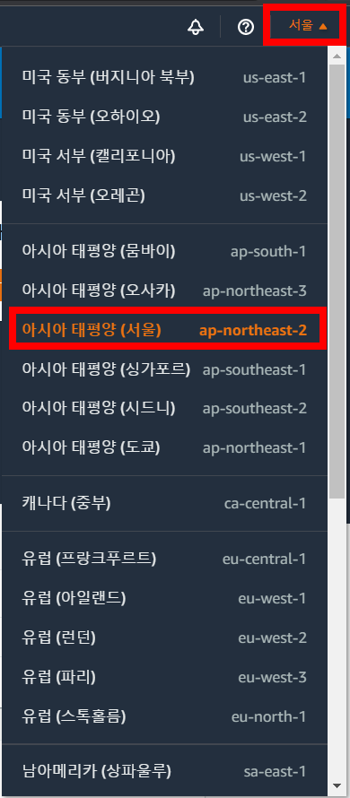

**Task 1. Cloud9 환경 구성**

1. AWS 계정으로 로그인  
2. 우측 상단의 리전을 서울로 선택  
  
3. 상단 검색창에 Cloud9 검색 후 Cloud9 서비스 클릭

4. Create Environment 클릭 후 적당한 Name 입력, Next Step 클릭

5. Cloud9 환경 옵션을 아래와 같이 설정
> Instance type : t3.small 
> Platform : Ubuntu 18.04
> 나머지 옵션 : 기본값

Next step 클릭, Create Environment 클릭

6. 생성 완료 화면

7. kubectl 설치
```
curl -o kubectl https://s3.us-west-2.amazonaws.com/amazon-eks/1.23.7/2022-06-29/bin/linux/amd64/kubectl
```
```
chmod +x ./kubectl
```
```
mkdir -p $HOME/bin && cp ./kubectl $HOME/bin/kubectl && export PATH=$PATH:$HOME/bin
```
```
echo 'export PATH=$PATH:$HOME/bin' >> ~/.bashrc
```
```
kubectl version --short --client
```